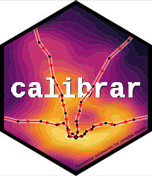

<!-- README.md is generated from README.Rmd. Please edit that file -->

```{r, echo = FALSE}
knitr::opts_chunk$set(
  collapse = TRUE,
  comment = "#>",
  fig.path = "man/figures/README"
)
```

# calibrar <a href="https://roliveros-ramos.github.io/calibrar/"></a>

<!-- badges: start -->
[](https://CRAN.R-project.org/package=calibrar)

[](https://github.com/roliveros-ramos/calibrar/actions/workflows/R-CMD-check.yaml)
[](https://github.com/roliveros-ramos/calibrar/issues)
[](https://www.bestpractices.dev/projects/2132)
[](https://CRAN.R-project.org/package=calibrar)
[](https://app.codecov.io/gh/roliveros-ramos/calibrar)
<!-- badges: end -->

## Overview

  This package allows the parameter estimation (i.e. calibration) of complex models, including stochastic ones. It implements generic functions that can be used for fitting any type of models, especially those with non-differentiable objective functions, with the same syntax as base::optim. 
  It supports multiple phases estimation (sequential parameter masking), constrained optimization (bounding box restrictions) and automatic parallel computation of numerical gradients. 
  Some common maximum likelihood estimation methods and automated construction of the objective function from simulated model outputs is provided.  
  See <https://roliveros-ramos.github.io/calibrar/> for more details.

## Installation

```{r, eval = FALSE}
# The easiest way to get calibrar is to install it from CRAN:
install.packages("calibrar")

# Alternatively, install the stable development version from OSMOSE drat repository:
install.packages("calibrar", repo="https://osmose-model.github.io/drat/")

# Or the development version from GitHub:
# install.packages("pak")
remotes::install_github("roliveros-ramos/calibrar")
```

## Usage

For a quick introduction, check the worked the examples available from the package:

```{r, eval = FALSE}
library(calibrar)
vignette("calibrar")
```

For a more detailed explanation of the package philosophy, you can read the pre-print [calibrar: an R package for fitting complex ecological models][publication].

## Contributions

If you find any bug, have questions about the documentation or requests for enhancements, please [open an issue][issues].

Contributions are accepted as pull requests. 
Please note that the calibrar package is released with a [Contributor Code of Conduct](https://www.contributor-covenant.org/version/2/1/code_of_conduct/). By contributing to this project, you agree to abide by its terms. 


[publication]: https://arxiv.org/abs/1603.03141
[issues]: https://github.com/roliveros-ramos/calibrar/issues
