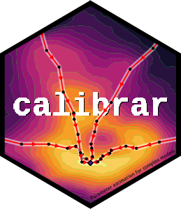

# Automated Calibration for Complex Models

Automated Calibration for Complex Models

## Details

calibrar package: Automated Calibration for Complex Models



This package allows the parameter estimation (i.e. calibration) of
complex models, including stochastic ones. It implements generic
functions that can be used for fitting any type of models, especially
those with non-differentiable objective functions, with the same syntax
as base::optim. It supports multiple phases estimation (sequential
parameter masking), constrained optimization (bounding box restrictions)
and automatic parallel computation of numerical gradients. Some common
maximum likelihood estimation methods and automated construction of the
objective function from simulated model outputs is provided. See
\<https://roliveros-ramos.github.io/calibrar/\> for more details.

## References

calibrar: an R package for the calibration of ecological models
(Oliveros-Ramos and Shin 2014)

## See also

Useful links:

- <https://roliveros-ramos.github.io/calibrar/>

- Report bugs at <https://github.com/roliveros-ramos/calibrar/issues>

## Author

Ricardo Oliveros-Ramos Maintainer: Ricardo Oliveros-Ramos
\<ricardo.oliveros@gmail.com\>

## Examples

``` r
if (FALSE) { # \dontrun{
require(calibrar)
set.seed(880820)
path = NULL # NULL to use the current directory
# create the demonstration files
demo = calibrar_demo(model="PoissonMixedModel", L=5, T=100) 
# get calibration information
calibrationInfo = calibration_setup(file=demo$path)
# get observed data
observed = calibration_data(setup=calibrationInfo, path=demo$path)
# read forcings for the model
forcing = read.csv(file.path(demo$path, "master", "environment.csv"), row.names=1)
# Defining 'runModel' function
runModel = function(par, forcing) {
output = calibrar:::.PoissonMixedModel(par=par, forcing=forcing)
# adding gamma parameters for penalties
output = c(output, list(gammas=par$gamma)) 
return(output)
}
# real parameters
cat("Real parameters used to simulate data\n")
print(demo$par)
# objective functions
obj  = calibration_objFn(model=runModel, setup=calibrationInfo, 
                               observed=observed, forcing=forcing)
cat("Starting calibration...\n")
control = list(weights=calibrationInfo$weights, maxit=3.6e5) # control parameters
cat("Running optimization algorithms\n", "\t", date(), "\n")
cat("Running optim AHR-ES\n")
ahr = calibrate(par=demo$guess, fn=obj, lower=demo$lower, upper=demo$upper, control=control)
summary(ahr)
} # } 
```
